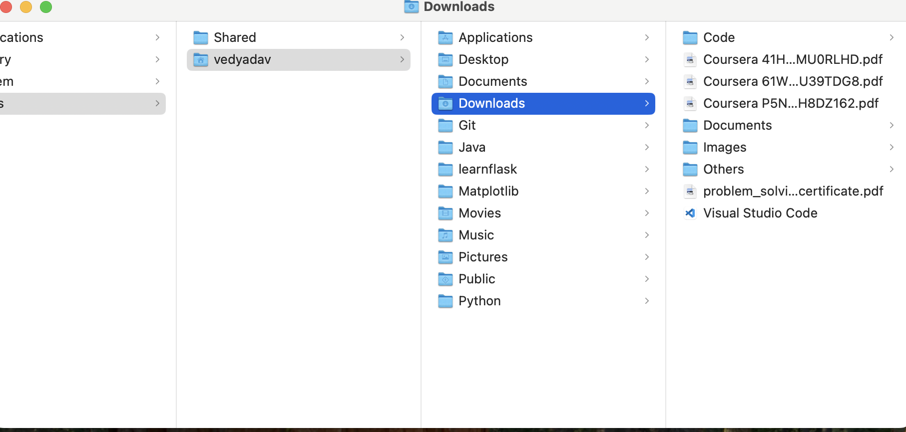

# 📂 Sortify - File Organizer  

Sortify is a simple and elegant desktop application built with **Python** and **Tkinter** 
that helps you automatically organize files in a selected folder into categorized subfolders
like **Images, Documents, Videos, Music, Archives, Executables, Code, and Others**.  

---

## 🚀 Features  
- Organizes files into predefined categories based on extensions.  
- Creates subfolders automatically (e.g., Images, Documents, Music, Archives , Codes etc.).  
- User-friendly GUI with a clean design.  
- Works with just **one click** – no complicated setup.  
- Handles unknown file types by placing them in the **Others** folder.  

---

## 📸 Screenshot  
- **Before Sortify**  
  

- **Sortify window**  
    

- **Folder selection**  
    

- **Organised sucessfully**  
  

  - **After Sortify**  
    

---

## 🛠️ Installation & Usage  

```bash
# Clone the repository
git clone https://github.com/Vedprakash-Yadav/sortify.git
cd sortify

# Run the application
python sortify.py
